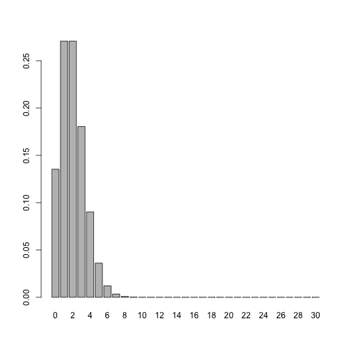

Today our lab will deal with Poisson variables and, eventually properties of indepdendent variables

# Poisson!

Just like with the Binomial distribution, R has built in functions that help us learn about the Poisson distribution.  

Take a moment and try different values in the functions below:


```r
dpois(3, 4)    #returns the probability of being equal to a particular value for a Poisson random variable
```

```
## [1] 0.1953668
```

```r
ppois(3, 4)    #returns the probability of being <= to a particular value for a Poisson random variable
```

```
## [1] 0.4334701
```

```r
rpois(3, 4)    #generates one or more Poisson random variables
```

```
## [1] 5 6 4
```


R also has several one-word or one-letter functions that make it easy to understand the properties of random variables


```r
x<-c(10,12,14,19)
median(x)    #returns the median of x
```

```
## [1] 13
```

```r
mean(x)      #returns the average of x
```

```
## [1] 13.75
```

```r
var(x)       #returns the variance of x
```

```
## [1] 14.91667
```

```r
x**2         #returns the squared value of x
```

```
## [1] 100 144 196 361
```

```r
sum(x==12)/length(x)   #returns the fraction of times elements in x are greater than 10
```

```
## [1] 0.25
```

```r
sum(x>13)/length(x)   #returns the fraction of times elements in x are greater than 10
```

```
## [1] 0.5
```

A final useful tool in R is the command `lines` which allows you to add a line of best fit to a histogram. Heres one example with the Poisson distribution


```r
n<-10000
lambda<-6
x<-rpois(n, lambda)
hist(x,freq=FALSE)
lines(seq(0,3*lambda),dpois(seq(0,3*lambda),lambda))
```

 


## Exercise 1

The number of goals scored by the New York Rangers in a game is distributed Poisson ($\lambda$ = 2.7). Is it more likely that the Rangers score 2 goals or 3 goals in the game? Why does this result seem strange? Find the value of $\lambda$ for which P(X=2) = P(X=3), which can be done by hand or using R. 


## Exercise 2

Use the code below to visualize what a Poisson distribution looks like.  

```r
n<-30
lambda<- 2
barplot(dpois(0:n,lambda), names.arg=0:n)
```

 

Try different values of `lambda` while keeping `n` equal to 30.  What values of `lambda` cause the distribution look most skewed? What values of `lambda` make the distribution look symmetric?

## Exercise 3

#### Happy Puppies! 

Let's say the number of times that Foofoo the puppy wags it's tail in an hour is distributed as a Poisson random variable.  Foofoo the puppy wags it's tail 8.4 times an hour on average.  I want to find out what is the probability that Foofoo will wag his tail more than 10 times in an hour.  

### Exercise 3a 

Using one of the R functions, find the exact probability for Foofoo here


### Exercise 3b 

Estimate the probability that Foofoo will wag his tail more than 10 times in an hour using simulations. Some sample code is below. Are your two answers identical? 


```r
n<-100000
lambda<-8.4
wagging.hours<-rpois(n, lambda)
sum(wagging.hours>10)/n  #simulated probability
```

```
## [1] 0.22725
```


## Exercise 4

In the same house as FooFoo, let's also suppose that the number of times a baby smiles in an hour is a Poisson random variable (Y) with parameter equal to 4.  In other words: X~Poisson(8.4) and Y~Poisson (4). 

### Exercise 4a

Simulate `n` draws of X and Y, and use different lines of best fit to see which one best matches a histogram of X + Y, give one guess as to the distribution of X+Y


### Exercise 4b

This is a major property of Poisson variables (it holds not just for the Poisson distribution). Define it here for general variables X and Y with parameters $\lambda_1$ and $\lambda_2$

## Exercise 5

As the final part of our lab, we define some properties of random variables using RStudio. Let's return to our two Poisson variables, Foofoo (X) and the smiling baby (Y). Use simulations to answer the following exercises, with help from the `mean' and `var' commands. Then, try to define each property in more general terms (parts 5b, 5c, 5d and 5e only). 

### Exercise 5a

What are the expected values of variables X and Y, respectively? 

### Exercise 5b

What is the expected value of the sum of random variables X and Y?

### Exercise 5c

What are the variances of random variables X and Y, respectively?

### Exercise 5d

What is the variance of the sum of random variables X and Y?

### Exercise 5e

Let Z = aX + b, for any constant `a` and `b`. What is the expected value and variance of Z? 

